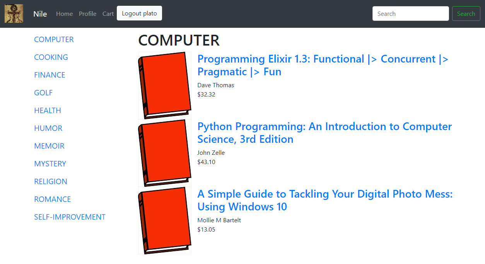

# Sample mithril apps

Here are some example apps

## [nile-mithril](https://nile-mithril.idgen.com)

A sample online bookstore written in mithril. It demonstrates how to interact with backend servers, maintain sessions, state and shoping history.

The source code for [nile-mithril is here](https://github.com/highmountaintea/nile-mithril).
* [nile-server](https://www.npmjs.com/package/nile-server): nile-mithril is built against nile-server, which provides a simple backend that simulates the APIs of a simple book store. It allows you to write your own sample book store app in any framework you want.
